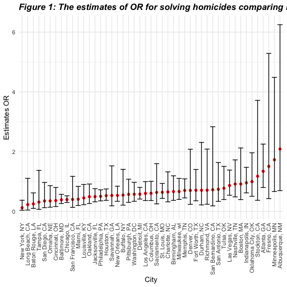
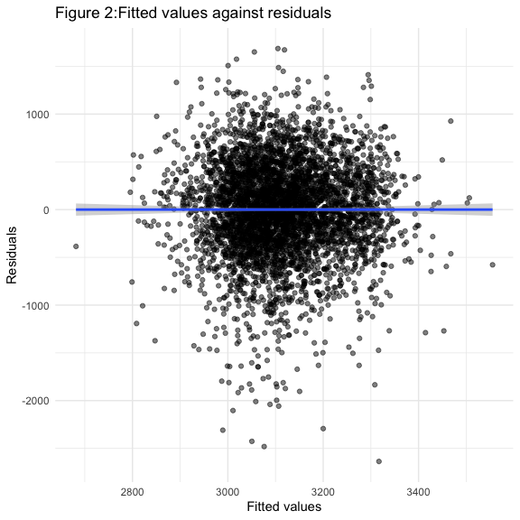
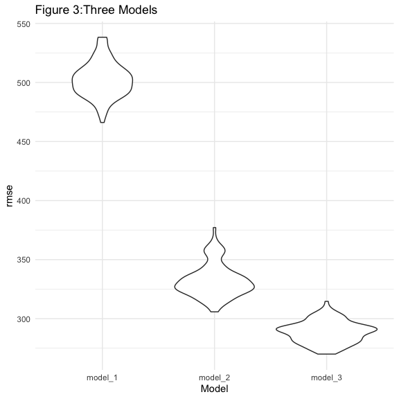

P8105_hw6_REN XIN
================
2022-11-30

\###Problem 1:

\###Problem 2:

\##Step 1: import the data.

``` r
homicides_df = read_csv("data/homicide-data.csv",na = c("", "NA", "Unknown"))
```

    ## Rows: 52179 Columns: 12
    ## ── Column specification ────────────────────────────────────────────────────────
    ## Delimiter: ","
    ## chr (8): uid, victim_last, victim_first, victim_race, victim_sex, city, stat...
    ## dbl (4): reported_date, victim_age, lat, lon
    ## 
    ## ℹ Use `spec()` to retrieve the full column specification for this data.
    ## ℹ Specify the column types or set `show_col_types = FALSE` to quiet this message.

``` r
homicides_df
```

    ## # A tibble: 52,179 × 12
    ##    uid   repor…¹ victi…² victi…³ victi…⁴ victi…⁵ victi…⁶ city  state   lat   lon
    ##    <chr>   <dbl> <chr>   <chr>   <chr>     <dbl> <chr>   <chr> <chr> <dbl> <dbl>
    ##  1 Alb-…  2.01e7 GARCIA  JUAN    Hispan…      78 Male    Albu… NM     35.1 -107.
    ##  2 Alb-…  2.01e7 MONTOYA CAMERON Hispan…      17 Male    Albu… NM     35.1 -107.
    ##  3 Alb-…  2.01e7 SATTER… VIVIANA White        15 Female  Albu… NM     35.1 -107.
    ##  4 Alb-…  2.01e7 MENDIO… CARLOS  Hispan…      32 Male    Albu… NM     35.1 -107.
    ##  5 Alb-…  2.01e7 MULA    VIVIAN  White        72 Female  Albu… NM     35.1 -107.
    ##  6 Alb-…  2.01e7 BOOK    GERALD… White        91 Female  Albu… NM     35.2 -107.
    ##  7 Alb-…  2.01e7 MALDON… DAVID   Hispan…      52 Male    Albu… NM     35.1 -107.
    ##  8 Alb-…  2.01e7 MALDON… CONNIE  Hispan…      52 Female  Albu… NM     35.1 -107.
    ##  9 Alb-…  2.01e7 MARTIN… GUSTAVO White        56 Male    Albu… NM     35.1 -107.
    ## 10 Alb-…  2.01e7 HERRERA ISRAEL  Hispan…      43 Male    Albu… NM     35.1 -107.
    ## # … with 52,169 more rows, 1 more variable: disposition <chr>, and abbreviated
    ## #   variable names ¹​reported_date, ²​victim_last, ³​victim_first, ⁴​victim_race,
    ## #   ⁵​victim_age, ⁶​victim_sex

Create a city_state variable (e.g. “Baltimore, MD”), and a binary
variable indicating whether the homicide is solved. Omit cities Dallas,
TX; Phoenix, AZ; and Kansas City, MO – these don’t report victim race.
Also omit Tulsa, AL – this is a data entry mistake. For this problem,
limit your analysis those for whom victim_race is white or black. Be
sure that victim_age is numeric.

\##Step 2 :Create a city_state variable (e.g. “Baltimore, MD”), and a
binary variable indicating whether the homicide is solved. Omit cities
Dallas, TX; Phoenix, AZ; and Kansas City, MO – these don’t report victim
race. Also omit Tulsa, AL

``` r
homicides_df = homicides_df %>% 
  mutate(city_state = str_c(city, ", ", state)) %>% 
  filter(
    !city_state == c("Tulsa, AL", "Dallas, TX", "Phoenix, AZ", "Kansas City, MO"),
    victim_race == c("White", "Black")
  ) %>% 
  mutate(
    victim_age = as.numeric(victim_age),
    homicide_solved = case_when(
      disposition == "Closed without arrest" ~ 0,
      disposition == "Open/No arrest"        ~ 0,
      disposition == "Closed by arrest"      ~ 1
    )
  ) %>%
  select(city_state, homicide_solved, victim_age, victim_sex, victim_race)

homicides_df
```

    ## # A tibble: 19,893 × 5
    ##    city_state      homicide_solved victim_age victim_sex victim_race
    ##    <chr>                     <dbl>      <dbl> <chr>      <chr>      
    ##  1 Albuquerque, NM               0         15 Female     White      
    ##  2 Albuquerque, NM               0         72 Female     White      
    ##  3 Albuquerque, NM               0         56 Male       White      
    ##  4 Albuquerque, NM               1         22 Female     White      
    ##  5 Albuquerque, NM               1         25 Male       Black      
    ##  6 Albuquerque, NM               1         20 Male       White      
    ##  7 Albuquerque, NM               0         88 Female     White      
    ##  8 Albuquerque, NM               0         36 Female     White      
    ##  9 Albuquerque, NM               1         24 Male       White      
    ## 10 Albuquerque, NM               1         50 Male       White      
    ## # … with 19,883 more rows

Description：I filtered 5 variables as col according to the
requirements, they are city_state, homicide_solved, victim_age,
victim_sex, victim_race. This table has 19,893 entries and 5 total
columns.

\##Step 3 : For the city of Baltimore, MD, use the glm function to fit a
logistic regression with resolved vs unresolved as the outcome and
victim age, sex and race as predictors. Save the output of glm as an R
object; apply the broom::tidy to this object; and obtain the estimate
and confidence interval of the adjusted odds ratio for solving homicides
comparing male victims to female victims keeping all other variables
fixed.

``` r
baltimore_df =
  homicides_df %>%
    filter(city_state == "Baltimore, MD")
  glm(
    homicide_solved ~ victim_age + victim_race + victim_sex,data = baltimore_df,family = binomial()) %>%
  broom::tidy() %>% 
  mutate(
    OR = exp(estimate), 
    lower_CI = exp(estimate - 1.96 * std.error),
    upper_CI = exp(estimate + 1.96 * std.error)
  ) %>% 
  select(term, OR,lower_CI, upper_CI,p.value) %>% 
    
knitr::kable(digits = 3)
```

| term             |    OR | lower_CI | upper_CI | p.value |
|:-----------------|------:|---------:|---------:|--------:|
| (Intercept)      | 1.644 |    1.027 |    2.634 |   0.039 |
| victim_age       | 0.989 |    0.980 |    0.999 |   0.027 |
| victim_raceWhite | 2.518 |    1.522 |    4.165 |   0.000 |
| victim_sexMale   | 0.391 |    0.266 |    0.573 |   0.000 |

``` r
baltimore_df
```

    ## # A tibble: 1,371 × 5
    ##    city_state    homicide_solved victim_age victim_sex victim_race
    ##    <chr>                   <dbl>      <dbl> <chr>      <chr>      
    ##  1 Baltimore, MD               0         17 Male       Black      
    ##  2 Baltimore, MD               0         21 Male       Black      
    ##  3 Baltimore, MD               1         61 Male       White      
    ##  4 Baltimore, MD               1         46 Male       Black      
    ##  5 Baltimore, MD               1         21 Male       Black      
    ##  6 Baltimore, MD               1         21 Male       Black      
    ##  7 Baltimore, MD               1         34 Male       Black      
    ##  8 Baltimore, MD               0         26 Male       Black      
    ##  9 Baltimore, MD               1         21 Male       Black      
    ## 10 Baltimore, MD               1         30 Male       Black      
    ## # … with 1,361 more rows

Description：Keeping all other variables fixed, and the estimate of the
adjusted odds ratio for solving homicides comparing male victims to
female victims is with 95% confidence interval (, )

Now run glm for each of the cities in your dataset, and extract the
adjusted odds ratio (and CI) for solving homicides comparing male
victims to female victims. Do this within a “tidy” pipeline, making use
of purrr::map, list columns, and unnest as necessary to create a
dataframe with estimated ORs and CIs for each city.

\##Step 4 :Run regression models across cities

``` r
models_df = 
  homicides_df %>% 
  nest(data = -city_state) %>% 
  mutate(
    models =  map(.x = data, ~glm(homicide_solved ~ victim_age + victim_race + victim_sex, data = .x, family = binomial())),
    results = map(models, broom::tidy)
    ) %>% 
  select(city_state, results) %>% 
  unnest(results) %>% 
  mutate(
    OR = exp(estimate), 
    lower_CI = exp(estimate - 1.96 * std.error),
    upper_CI = exp(estimate + 1.96 * std.error)
  ) %>% 
  select(city_state, term, OR, lower_CI,upper_CI)

models_df
```

    ## # A tibble: 188 × 5
    ##    city_state      term                OR lower_CI upper_CI
    ##    <chr>           <chr>            <dbl>    <dbl>    <dbl>
    ##  1 Albuquerque, NM (Intercept)      1.25     0.226    6.91 
    ##  2 Albuquerque, NM victim_age       0.975    0.948    1.00 
    ##  3 Albuquerque, NM victim_raceWhite 2.56     0.797    8.20 
    ##  4 Albuquerque, NM victim_sexMale   2.09     0.698    6.25 
    ##  5 Atlanta, GA     (Intercept)      2.35     1.21     4.53 
    ##  6 Atlanta, GA     victim_age       0.984    0.971    0.997
    ##  7 Atlanta, GA     victim_raceWhite 0.782    0.355    1.72 
    ##  8 Atlanta, GA     victim_sexMale   1.34     0.802    2.25 
    ##  9 Baltimore, MD   (Intercept)      1.64     1.03     2.63 
    ## 10 Baltimore, MD   victim_age       0.989    0.980    0.999
    ## # … with 178 more rows

Create a plot that shows the estimated ORs and CIs for each city.
Organize cities according to estimated OR, and comment on the plot.

\##Step 5: make a polt

``` r
models_df %>% 
  filter(term == "victim_sexMale") %>% 
  mutate(city_state = fct_reorder(city_state, OR)) %>% 
  ggplot(aes(x = city_state, y = OR)) + 
  geom_point(color = "red") + 
  geom_errorbar(aes(ymin = lower_CI, ymax = upper_CI)) + 
  theme(axis.text.x = element_text(angle = 90, vjust =0.5, hjust = 1),
        plot.title = element_text(face = "bold.italic")) +
  labs(title = 'Figure 1: The estimates of OR for solving homicides comparing male victims to female victims',
       y = "Estimates OR",
       x = "City")
```



``` r
models_df
```

    ## # A tibble: 188 × 5
    ##    city_state      term                OR lower_CI upper_CI
    ##    <chr>           <chr>            <dbl>    <dbl>    <dbl>
    ##  1 Albuquerque, NM (Intercept)      1.25     0.226    6.91 
    ##  2 Albuquerque, NM victim_age       0.975    0.948    1.00 
    ##  3 Albuquerque, NM victim_raceWhite 2.56     0.797    8.20 
    ##  4 Albuquerque, NM victim_sexMale   2.09     0.698    6.25 
    ##  5 Atlanta, GA     (Intercept)      2.35     1.21     4.53 
    ##  6 Atlanta, GA     victim_age       0.984    0.971    0.997
    ##  7 Atlanta, GA     victim_raceWhite 0.782    0.355    1.72 
    ##  8 Atlanta, GA     victim_sexMale   1.34     0.802    2.25 
    ##  9 Baltimore, MD   (Intercept)      1.64     1.03     2.63 
    ## 10 Baltimore, MD   victim_age       0.989    0.980    0.999
    ## # … with 178 more rows

Description：This graph shows that the estimated ORs are different among
the major 50 cities in the U.S. New York has the lowest estimated OR,
which indicates that homicide victims in New York are much less likely
to be solved by men than by women. In addition to the highest estimated
OR in Albuquerque, it is also clear from this graph that there are many
cities with wide confidence intervals, such as Fresno,CA, Stockton,CA,
Albuquerque,NM and Stockton,CA.

\###Problem 3:

\##Step 1: import the data and clean the data.

``` r
birthweight_df = read_csv("./data/birthweight.csv")
```

    ## Rows: 4342 Columns: 20
    ## ── Column specification ────────────────────────────────────────────────────────
    ## Delimiter: ","
    ## dbl (20): babysex, bhead, blength, bwt, delwt, fincome, frace, gaweeks, malf...
    ## 
    ## ℹ Use `spec()` to retrieve the full column specification for this data.
    ## ℹ Specify the column types or set `show_col_types = FALSE` to quiet this message.

``` r
birthweight_df = 
  birthweight_df %>% 
  janitor::clean_names() %>% 
  drop_na() %>% 
  filter(frace != "Unknown") %>%
 mutate(
    babysex = case_when(babysex == 1 ~ "male",babysex == 2 ~ "female"),
    malform = case_when(malform == 0 ~ "absent",malform == 1 ~ "present"),
    frace = case_when(frace == 1 ~ "White",frace == 2 ~ "Black",frace == 3 ~ "Asian",frace == 4 ~ "Puerto Rican",frace == 8 ~ "Other"),
    mrace = case_when(mrace == 1 ~ "White",mrace == 2 ~ "Black",mrace == 3 ~ "Asian",mrace == 4 ~ "Puerto Rican",mrace == 8 ~ "Other")
  ) %>% 
 mutate(
    babysex = as.factor(babysex),
    frace = as.factor(frace),
    malform = as.factor(malform),
    mrace = as.factor(mrace)
    ) 
sum(is.na(birthweight_df))
```

    ## [1] 0

``` r
birthweight_df
```

    ## # A tibble: 4,342 × 20
    ##    babysex bhead blength   bwt delwt fincome frace gaweeks malform menarche
    ##    <fct>   <dbl>   <dbl> <dbl> <dbl>   <dbl> <fct>   <dbl> <fct>      <dbl>
    ##  1 female     34      51  3629   177      35 White    39.9 absent        13
    ##  2 male       34      48  3062   156      65 Black    25.9 absent        14
    ##  3 female     36      50  3345   148      85 White    39.9 absent        12
    ##  4 male       34      52  3062   157      55 White    40   absent        14
    ##  5 female     34      52  3374   156       5 White    41.6 absent        13
    ##  6 male       33      52  3374   129      55 White    40.7 absent        12
    ##  7 female     33      46  2523   126      96 Black    40.3 absent        14
    ##  8 female     33      49  2778   140       5 White    37.4 absent        12
    ##  9 male       36      52  3515   146      85 White    40.3 absent        11
    ## 10 male       33      50  3459   169      75 Black    40.7 absent        12
    ## # … with 4,332 more rows, and 10 more variables: mheight <dbl>, momage <dbl>,
    ## #   mrace <fct>, parity <dbl>, pnumlbw <dbl>, pnumsga <dbl>, ppbmi <dbl>,
    ## #   ppwt <dbl>, smoken <dbl>, wtgain <dbl>

Description：There is no missing data. This database totally has 20
columns and 4342 rows.

Propose a regression model for birthweight. This model may be based on a
hypothesized structure for the factors that underly birthweight, on a
data-driven model-building process, or a combination of the two.
Describe your modeling process and show a plot of model residuals
against fitted values – use add_predictions and add_residuals in making
this plot.

\##Step 1: builed a model

Among these variables, I believe that in addition to head circumference,
length, sex, ength at birth and gestational age, there are other
variables that can affect the birth weight of an infant, these are
fincome, smoken and ppbmi. Therefore, I made the following hypothesis:
1.The higher the monthly household income, the better quality food the
mother receives and therefore the heavier the baby. 2.Mothers who smoke,
resulting in babies born with deformities or malnutrition. 3.The higher
the mother’s pre-pregnancy BMI, the greater the resulting infant weight.

``` r
model_1 = lm(bwt ~ fincome + smoken + ppbmi, data = birthweight_df)
broom::tidy(model_1)
```

    ## # A tibble: 4 × 5
    ##   term        estimate std.error statistic  p.value
    ##   <chr>          <dbl>     <dbl>     <dbl>    <dbl>
    ## 1 (Intercept)  2658.      54.1       49.1  0       
    ## 2 fincome         3.22     0.294     11.0  1.35e-27
    ## 3 smoken         -6.16     1.03      -5.97 2.53e- 9
    ## 4 ppbmi          15.8      2.39       6.58 5.21e-11

``` r
model_1
```

    ## 
    ## Call:
    ## lm(formula = bwt ~ fincome + smoken + ppbmi, data = birthweight_df)
    ## 
    ## Coefficients:
    ## (Intercept)      fincome       smoken        ppbmi  
    ##    2657.974        3.223       -6.157       15.752

\##Step 2: use add_predictions and add_residuals in making this plot

``` r
birthweight_df %>% 
  add_predictions(model_1) %>% 
  add_residuals(model_1) %>% 
  ggplot(aes(x = pred, y = resid)) + 
  geom_point(alpha = .5) +
  geom_smooth(method = "lm") + 
  labs(title = "Figure 2:Fitted values against residuals", 
       x = "Fitted values", 
       y = "Residuals")
```

    ## `geom_smooth()` using formula 'y ~ x'



Description：The residuals are distributed around 0 along the fitted
values - without showing any pattern associated with the fitted values.

\##Step 3: Compare your model to two others:

``` r
model_2 = lm(bwt ~ blength + gaweeks, data = birthweight_df)
  model_2 %>%
  broom::tidy()
```

    ## # A tibble: 3 × 5
    ##   term        estimate std.error statistic  p.value
    ##   <chr>          <dbl>     <dbl>     <dbl>    <dbl>
    ## 1 (Intercept)  -4348.      98.0      -44.4 0       
    ## 2 blength        129.       1.99      64.6 0       
    ## 3 gaweeks         27.0      1.72      15.7 2.36e-54

``` r
model_3 = lm(bwt ~ bhead + babysex + blength + bhead * babysex + bhead * blength + babysex * blength + babysex * blength * bhead, data = birthweight_df)
  model_3 %>% 
  broom::tidy()
```

    ## # A tibble: 8 × 5
    ##   term                      estimate std.error statistic    p.value
    ##   <chr>                        <dbl>     <dbl>     <dbl>      <dbl>
    ## 1 (Intercept)                -802.    1102.       -0.728 0.467     
    ## 2 bhead                       -16.6     34.1      -0.487 0.626     
    ## 3 babysexmale               -6375.    1678.       -3.80  0.000147  
    ## 4 blength                     -21.6     23.4      -0.926 0.354     
    ## 5 bhead:babysexmale           198.      51.1       3.88  0.000105  
    ## 6 bhead:blength                 3.32     0.713     4.67  0.00000317
    ## 7 babysexmale:blength         124.      35.1       3.52  0.000429  
    ## 8 bhead:babysexmale:blength    -3.88     1.06     -3.67  0.000245

\##Step 4: Test the model fit

``` r
set.seed(1)
cv_df = 
  crossv_mc(birthweight_df, 100) %>% 
  mutate(
    train = map(train, as_tibble),
    test = map(test, as_tibble)
  )
```

\##Step 5: Make this comparison in terms of the cross-validated
prediction error:

``` r
cv_df = 
  cv_df %>% 
  mutate(
    model_1 = map(.x = train, ~ lm(bwt ~ fincome + smoken + ppbmi, data = .x)),
    model_2 = map(.x = train, ~lm(bwt ~ blength + gaweeks, data = .x)),
    model_3 = map(.x = train, ~lm(bwt ~ bhead + babysex + blength + bhead * babysex + bhead * blength + babysex * blength + babysex * blength * bhead, data = .x))
    )%>% 
  mutate(
    rmse_model_1 = map2_dbl(.x = model_1, .y = test, ~rmse(model = .x, data = .y)),
    rmse_model_2 = map2_dbl(.x = model_2, .y = test, ~rmse(model = .x, data = .y)),
    rmse_model_3 = map2_dbl(.x = model_3, .y = test, ~rmse(model = .x, data = .y))
  )
```

\##Step 6:Draw a violin plot:

``` r
cv_df %>% 
  select(starts_with("rmse")) %>% 
  pivot_longer(
    everything(),
    names_to = "model",
    values_to = "rmse",
    names_prefix = "rmse_") %>% 
  ggplot(aes(x = model, y = rmse)) +
  labs(
    title = 'Figure 3:Three Models',
    x = 'Model',
    y = 'rmse')+
   geom_violin()
```



Description：The graph above compares the prediction errors of the three
models and we clearly find that model_3 is the best model because it has
the lowest RMSE value compared to the other two models（model_1 and
model_2). This indicates that using head circumference, length, sex, and
all interactions is the best model, which also means that it can predict
the birth weight of the child better than model_1 and model_2.
